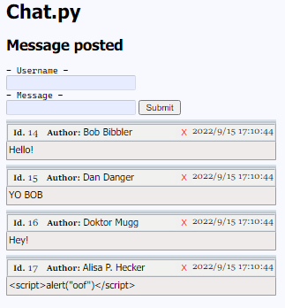

chat.py
=======
  A tiny sqlite3 based chat, where you can post, delete, edit and read messages.
  Can be integrated into a web interface or GUI.
  
  
# Defines
 - `prettify( messages )`
 - `timestring(  ) -> str`                                                        
 - `create_database( path )`                                               
 - `clear_database( path  str )`                                          
 - `send_message( path, message, author=..., time=...) -> int`  
 - `recive_messages( path ) -> list(Message)`
 - `lookup_message( path, message_id ) -> Message`
 - `message_count( path  ) -> int`
 - `message_occurences( path, message, bounds_id ) -> int`
 - `previous_message_id( path ) -> int`
 - `refresh_database( path )`                                             
 - `remove_message( path, message_id=..., author = ... )`                 
 - `edit_message( path, message_id, message=..., author=..., time=... )`
 - `Message( id, author, message, time )`
 
 # How To Use and install
 
  1. Create a database with sqlite3 and store the name in `DB_PATH`, the default value of `DB_PATH` is `./data/chat.db`, you can use the provided script to create the database if you are on a UNIX system. First `chmod +x create_database.sh` then `./create_database.sh`
  
  ```sh
  mkdir data
  echo .save ./data/chat.db | sqlite3 -batch
  ```
  
  
  2. Run `create_database(DB_PATH)` to create all the tables etc.
  
  3. ???
  
  ```python
>>> send_message(DB_PATH, "Hello world")

>>> send_message(DB_PATH, "Foo")

>>> send_message(DB_PATH, "Bar")

>>> prettify(recive_messages(DB_PATH))
```
```
Id.1 `Anonymous` at 2022/9/15 6:34:41
>Hello world

Id.2 `Anonymous` at 2022/9/15 6:34:41
>Foo

Id.3 `Anonymous` at 2022/9/15 6:34:41
>Bar
  ```
  4. profit!!!
  
## Functionalities  
 - Post a message:   `send_message()`
 - Edit a message:   `edit_message()`
 - Remove a message: `remove_message()`
 - Read the chat:    `recive_messages()`, `lookup_message()`

- `refresh_database()` will reorganize the database 
which takes some time, but will make it faster
 to use if large.

- `clear_database()` will remove all tables created 
 for the chat, leaving a blank database.


**Note** that the retrived messages are of the `Message` class.
Messages can be sent using `Message.send()` which will send
the message. This is not recommended.

# Database

```sql
CREATE TABLE chat (
       id INTEGER PRIMARY KEY AUTOINCREMENT,
       author  TEXT,
       message TEXT,
       time    TEXT
);

CREATE INDEX chat_index ON chat(id);
```
